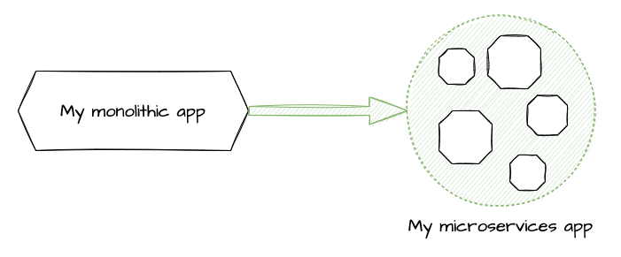
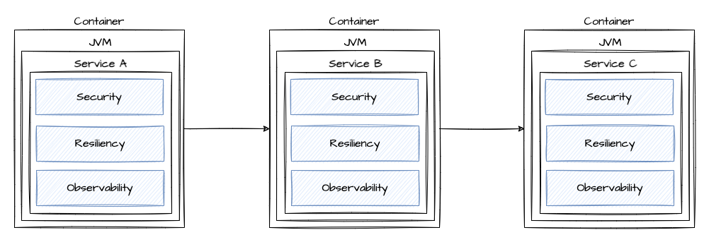

# Open Tour 2022 - Service Mesh

In this workshop we'll have a look at how a Service Mesh can help us to enhance the Security, Observability and Resiliency of our microservices. And all that without the need to add any libraries (say Hello to resilience4j and Spring Cloud) or to write infrastructure-related code.

## About Service Meshes

What means Security, Observability and Resiliency in our microservice landscape?


* Traffic shaping allows us to release new software versions as "Canary releases" to avoid the risk of a Big Bang / All at Once approach.

## Microservice architectures

After some success and some more challenges with monolithic applications, platforms like Kubernetes and Microservice architectures came to our rescue. Greenfield apps are developed in microservices now, and existing monoliths (aka legacy apps) are converted into microservices.



Over time, our microservice app quickly evolves to a network of microservices:


And it becomes increasingly difficult to locate failures and achieve resiliency.


Obviously, at this stage, we have to do something for better Security, Observability and Resiliency:

* All traffic should be secure (mTLS)
* We want to have information about health, requests, error rates, transactions, distributed traces and so on
* We want to avoid the [Fallacies of Distributed Computing](https://en.wikipedia.org/wiki/Fallacies_of_distributed_computing) by implementing Resiliency pattern like Circuit Breaker, Retries and Timeouts

### Embedding capacities in our microservices

Service Registries and Config Server were needed to keep the fleet of microservices under control, libraries like Netflix Hystrix, the Feign Client, Sleuth etc. (most of them very soon bundled in Spring Cloud for easy usage in Spring Boot applications) came to the rescue and helped us to implement patterns for Resiliency and Observability. 



**It works, but not the perfect solution:**

* Lots of libraries
* Infrastructure-related code needed but we want to focus on business functionality
* Libs in other languages like Python, Ruby, JavaScript/NodeJS not available

### The Sidecar


## Projects

Deploy projects service-a, service-b, service-c.

Call service-a to see the call hierarchy. service-c has endpoints to throw errors ('/misbehave', '/behave').

Projects can be run via docker ('podman-compose up --build') or deployed to OpenShift Kubernetes (see Deployment files in folder 'kubernetes').

## OpenShift Service Mesh preparation

See https://docs.openshift.com/container-platform/4.11/service_mesh/v2x/installing-ossm.html

Install in order:

* **OpenShift Elasticsearch**  
Namespace: openshift-operators-redhat
* **Red Hat OpenShift distributed tracing platform**  
Namespace: openshift-distributed-tracing
* **Kiali**  
Namespace: openshift-operators
* **Red Hat OpenShift Service Mesh**  
Namespace: openshift-operators

Then:

* Create "istio-system" namespace
* Install ServiceMeshControlPlane (istio/controlplane.yml)
* Create ServiceMeshMemberRoll (istio/memberroll.yml)

## Using the Service Mesh

### Deploy the sample apps

In your apps project, deploy the sample apps:

```
oc create -f kubernetes/a-deploy.yml
oc create -f kubernetes/b-deploy.yml
oc create -f kubernetes/c-v1-deploy.yml
oc create -f kubernetes/c-v2-deploy.yml
```

Check the pods - all pods should be running and you should see in the READY column "2/2". Why 2? In the pod are 2 containers - one for the app and one for the Envoy Sidecar.

### Create a Gateway for Ingress

Now we create a Gateway and expose our service-a.

```
oc create -f kubernetes/gateway.yml
oc get route istio-ingressgateway -n YOUR_CONTROL_PLANE_NAMESPACE

ROUTE=....
curl $ROUTE/service-a
```

If the services respond correctly, continue.

### Canary Releases

```
oc create -f kubernetes/destination-rules.yml
```

Open a second terminal and run:
```
ROUTE=...
while true; do curl $ROUTE/service-a; sleep 0.5; done
```

Now in your first terminal apply the files for the Canary Deployment:

```
oc create -f kubernetes/canary/1-vs-v1.yml
oc replace -f kubernetes/canary/2-vs-v1_and_v2_90_10.yml
oc replace -f kubernetes/canary/3-vs-v1_and_v2_50_50.yml
oc replace -f kubernetes/canary/4-vs-v2.yml
```

Check Kiali and Jaeger, you can open these from OpenShift Console (Networing Routes).

### Circuit Breaker and Retry

Let the terminal with the curl loop running or open a new one:
```
ROUTE=...
while true; do curl $ROUTE/service-a; sleep 0.5; done
```

```
oc scale deploy/service-c-v1 --replicas 0
oc scale deploy/service-c-v2 --replicas 2
oc replace -f kubernetes/circuit-breaker/1-vs.yml
```

Now connect to service-c and let it crash... in a separate terminal, run

```
oc get pod
POD_NAME=....
oc port-forward pod/$POD_NAME 8080:8080
curl localhost:8080/crash
```

See what happens in the terminal with the curl loop.

Now apply the Circuit Breaker (check what happens), then the Retry policy.

```
oc replace -f kubernetes/circuit-breaker/2-destination-rules.yml
oc replace -f kubernetes/circuit-breaker/3-vs-retry.yml
```

Finally repair the crashed service:
```
curl localhost:8080/repair
```

After ~10 seconds the repaired pod gets traffic.


Congratulations, you made it!!
